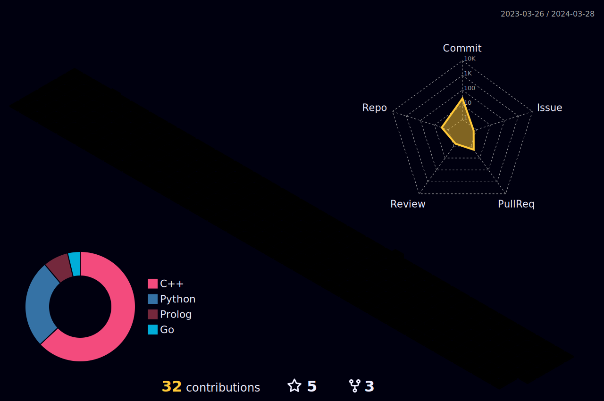

  
   
  <h1>Hello there! 👋</h1>
  

    👉 My name is Nícolas, and I'm a software engineering student at the University of Brasilia. Take a look at the projects I participated in! nice to meet you! 
  

  

## 🤝 About Me

   
              

  I am currently deepening my knowledge of Data Science and Artificial Intelligence in Python and C++.

  
  

  
